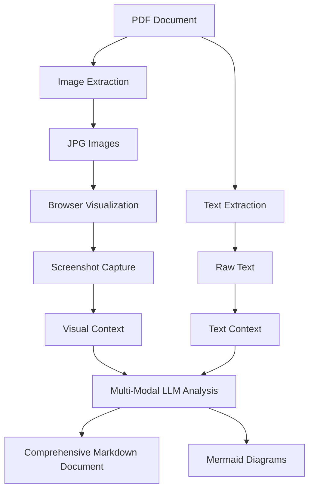

# Making PDFs LLM-Friendly: A Complete Workflow

In today's AI-driven world, getting large language models (LLMs) to understand and analyze PDF documents remains challenging. PDFs often contain complex layouts, embedded images, and text that's difficult to extract programmatically. This post presents a comprehensive workflow for transforming PDFs into LLM-friendly formats, combining image extraction, OCR, and browser tools for maximum context retention.

## The PDF Challenge for LLMs

PDFs pose several challenges for LLMs:

1. **Mixed Content Types**: Text, images, tables, and diagrams all in one document
2. **Layout Information**: Spatial relationships that carry meaning
3. **Embedded Images**: Visual content that contains important information
4. **Text as Images**: Text rendered as pixels rather than selectable characters

Our solution addresses these challenges through a multi-modal approach that leverages the dual capabilities of modern LLMs.

## Why Multi-Modal LLMs are Critical

Modern multi-modal LLMs like GPT-4o, Claude 3.5 Sonnet, and Gemini Pro are essential for this workflow because they possess two complementary capabilities:

1. **Text Processing**: Traditional language understanding for extracted text content
2. **Computer Vision**: Ability to analyze images, diagrams, layouts, and visual elements

This dual capability is crucial for PDFs because:

- **Visual Elements**: Charts, diagrams, infographics, and layout-dependent information that can't be captured in plain text
- **Embedded Text in Images**: Text that appears within images, screenshots, or scanned documents
- **Spatial Relationships**: Understanding how visual elements relate to surrounding text
- **Layout Analysis**: Recognizing headers, columns, sidebars, and document structure through visual cues
- **Cross-Modal Understanding**: Connecting textual descriptions with their corresponding visual representations

Without multi-modal capabilities, an LLM would miss critical information that exists only in the visual domain, making incomplete or inaccurate analyses of complex documents.

## The Solution: A Three-Pronged Approach



## Step 1: Extract Images from PDF

Our first tool is a Python script that converts each page of a PDF into high-quality JPG images:

```python
# take_screenshots.py
#!/usr/bin/env python3

import os
from pdf2image import convert_from_path
from PIL import Image

def extract_pdf_pages_as_jpg(pdf_path, output_dir):
    """
    Extract each page from PDF as JPG images
    """
    try:
        # Convert PDF to images
        print(f"Converting PDF: {pdf_path}")
        images = convert_from_path(pdf_path, dpi=300)  # High quality DPI
        
        # Create output directory if it doesn't exist
        os.makedirs(output_dir, exist_ok=True)
        
        # Save each page as JPG
        for i, image in enumerate(images, 1):
            output_path = os.path.join(output_dir, f"page_{i:02d}.jpg")
            
            # Convert to RGB if necessary (to avoid issues with transparency)
            if image.mode != 'RGB':
                image = image.convert('RGB')
            
            # Save as JPG with high quality
            image.save(output_path, 'JPEG', quality=95, optimize=True)
            print(f"Saved: {output_path}")
        
        print(f"\nSuccessfully extracted {len(images)} pages to {output_dir}")
        return len(images)
        
    except Exception as e:
        print(f"Error extracting PDF pages: {str(e)}")
        return 0
```

### Using the Script

The script accepts command-line arguments for easy customization:

```bash
python take_screenshots.py your_document.pdf --output output_folder
```

## Step 2: Extract Text with pdf2text

While images preserve layout, we also need machine-readable text. The `pdftotext` tool (part of Poppler utilities) provides this:

```bash
pdftotext -layout your_document.pdf extracted_text.txt
```

This preserves some layout information while making the text accessible to LLMs.

## Step 3: Visualize and Capture with Browser Tools

This is where the magic happens. Using [BrowserTools MCP](https://github.com/AgentDeskAI/browser-tools-mcp), we can:

1. Open each JPG in a browser
2. Take high-quality screenshots
3. Send these directly to the LLM's context

### Setting Up Browser Tools MCP

1. Install the Chrome extension: [BrowserTools MCP Chrome Extension](https://github.com/AgentDeskAI/browser-tools-mcp)
2. Install the MCP server: `npx @agentdeskai/browser-tools-mcp@latest`
3. Run the Node server: `npx @agentdeskai/browser-tools-server@latest`

## Essential Tool Requirements

This workflow demonstrates why a capable IDE is absolutely essential - it requires orchestrating multiple sophisticated tools:

### Software Dependencies:
- **Python packages**: `pdf2image`, `Pillow` (which depend on Poppler)
- **System utilities**: `pdftotext` (part of Poppler utilities)
- **Node.js**: For running MCP and browser tools servers
- **Chrome browser**: For displaying and capturing images

### Browser Tools (via MCP):
- **BrowserTools MCP Chrome extension**
- **MCP server**: `@agentdeskai/browser-tools-mcp`
- **Node server**: `@agentdeskai/browser-tools-server`

## Why an MCP-Capable IDE is Essential

This workflow requires an IDE with extensive capabilities because the LLM needs to orchestrate multiple tools and systems simultaneously. Here's what the IDE must support:

### Core Requirements:
1. **Model Context Protocol (MCP)** - For browser tools integration
2. **Terminal/Command Line Access** - For running Python scripts and system commands
3. **File System Operations** - For creating, reading, and editing files
4. **Multi-tool Orchestration** - For coordinating between different systems

### Tools the LLM Uses Throughout the Process:

#### File Operations:
- **File Creation**: Writing Python scripts, markdown documents, configuration files
- **File Reading**: Analyzing extracted text files, checking script outputs
- **File Editing**: Updating documentation incrementally as pages are processed
- **Directory Operations**: Creating output folders, organizing extracted images

#### Terminal Commands:
- **Python Script Execution**: Running `pdf2llm.py` to extract images and text
- **System Commands**: Using `open` (macOS) or equivalent to launch browser with images
- **Package Installation**: Installing dependencies like `pdf2image`, `poppler-utils`
- **Process Management**: Starting and monitoring MCP servers

#### Browser Tools (via MCP):
- **Screenshot Capture**: `takeScreenshot` to capture each page visually
- **Browser Control**: Opening specific files in the browser
- **Visual Analysis**: Processing the captured screenshots for content analysis

#### Text Processing:
- **PDF Text Extraction**: Using `pdftotext` for machine-readable content
- **Text Analysis**: Processing extracted text to identify sections and content
- **Cross-referencing**: Matching visual elements with corresponding text

Compatible IDEs include:
- **Cursor** (Full MCP support, excellent terminal integration)
- **Zed** (MCP capabilities, modern terminal)
- **Claude Desktop** (with MCP configuration)
- **Any IDE with Anthropic's MCP integration**

### Running the Python Script from Your IDE

You can have your IDE's LLM run the Python script directly with a prompt like this:

```
I have a PDF document called "document.pdf" that I need to analyze. Please:

1. Run the pdf2llm.py script to process this PDF
2. Set up the BrowserTools MCP environment
3. Help me analyze the content

Let's start by running:
python pdf2llm.py document.pdf
```

## Putting It All Together: The Complete LLM Prompt

Here's a comprehensive prompt template for your IDE's LLM to analyze the PDF:

```
I have a PDF document that I've processed using pdf2llm.py into both images and extracted text. Please systematically analyze this content using your multi-modal capabilities:

SETUP:
- Images are in: [folder_name]/page_XX.jpg
- Extracted text is in: [document_name]_text.txt

PROCESS FOR EACH PAGE:
1. Open page_XX.jpg in browser using: open -a "Google Chrome" "file://[full_path]/page_XX.jpg"
2. Take screenshot using BrowserTools MCP
3. Read corresponding text section: cat [document_name]_text.txt | sed -n '[line_range]p'
4. Cross-reference visual and textual content:
   - Identify charts, diagrams, images in the screenshot
   - Match visual elements with their text descriptions
   - Note information that exists only visually (charts, layouts, graphics)
   - Note information that exists only in text (detailed descriptions, data)

ANALYSIS GOALS:
- Summarize key points from both visual and textual analysis
- Identify document structure and section relationships
- Create mermaid diagrams to visualize processes, hierarchies, or workflows
- Extract tables into markdown format (from both visual and text sources)
- Document visual elements that enhance understanding beyond text
- Cross-reference text descriptions with their visual representations

OUTPUT:
Create a comprehensive markdown document that synthesizes both visual and textual understanding of the PDF.

Let's start with page_01.jpg and its corresponding text section.
```

## Sample Workflow

Here's how a complete workflow might look:

1. **Process the PDF in your IDE**:
   ```bash
   # Run the script directly from your IDE's terminal
   python pdf2llm.py annual_report.pdf --images report_images
   ```

2. **Set up BrowserTools MCP in separate terminals**:
   ```bash
   # Terminal 1: Start the MCP server
   npx @agentdeskai/browser-tools-mcp@latest
   
   # Terminal 2: Start the Node server
   npx @agentdeskai/browser-tools-server@latest
   ```

3. **In your IDE with BrowserTools MCP installed**:
   - Start a conversation with your LLM
   - Provide the prompt above
   - For each page, have the LLM run:
     ```bash
     # Open the image in browser
     open report_images/page_01.jpg
     
     # The LLM will automatically use BrowserTools to take a screenshot
     # It will execute: mcp_browser-tools-mcp_takeScreenshot
     
     # Read the corresponding extracted text for cross-reference
     cat annual_report_text.txt | head -n 50 | tail -n 20
     ```

4. **Let the LLM analyze and create**:
   - The LLM now has both visual and textual context
   - It can create comprehensive markdown documentation
   - It can generate mermaid diagrams based on the content
   
5. **Agentic Processing - Let the IDE Work Systematically**:
   
   The beauty of this approach is that your IDE can work autonomously through all pages. Here's the prompt that triggers this systematic processing:

   ```
   I need you to systematically analyze a PDF that has been converted to images and text. Please:

   1. Create a task list for yourself to open each page individually in the browser (JPEG) and take a screenshot
   2. Update the documentation one page at a time
   3. For each page:
      - Use terminal command: open -a "Google Chrome" "file://[full_path]/page_XX.jpg"
      - Take a screenshot using BrowserTools MCP
      - Read corresponding text section: cat extracted_text.txt | sed -n 'X,Yp' 
      - Analyze visual content (charts, diagrams, layout)
      - Cross-reference visual elements with extracted text descriptions
      - Identify information that exists only visually or only in text
      - Document findings combining both sources

   Start by creating your task list, then begin with page_01.jpg
   ```

   The IDE will then:
   - Generate a comprehensive task list (e.g., "1 of 37" pages)
   - Systematically open each JPEG in Chrome using terminal commands
   - Use `takeScreenshot` from BrowserTools MCP to capture each page
   - Build comprehensive documentation incrementally

## Real-World Example: The Agentic Workflow in Action

As demonstrated in the Cursor IDE screenshot, this workflow showcases the full power of an integrated development environment orchestrating multiple tools:

### The Complete Tool Chain in Action:

1. **Task Management**: 
   - LLM creates systematic task lists ("Open page_01.jpg in browser, take screenshot, and doc... 1 of 37")
   - Uses todo/task management tools to track progress through all pages

2. **Terminal Command Execution**: 
   ```bash
   open -a "Google Chrome" "file:///Users/ted.gulesserian.ext/commodity-broker-ratings/mvp_01/original_figma_pdf/page_01.jpg"
   ```

3. **Browser Tools Integration (MCP)**:
   - `takeScreenshot` - Captures high-quality screenshots of each page
   - `getConsoleLogs` - Monitors browser state if needed
   - `wipeLogs` - Cleans up between operations

4. **File System Operations**:
   - Reading extracted text files (`cat extracted_text.txt`)
   - Creating and updating markdown documentation
   - Managing image directories and file organization

5. **Content Analysis and Cross-Referencing**:
   - **Visual Analysis**: Processing screenshots to identify charts, diagrams, layout elements
   - **Text Analysis**: Reading extracted text to understand semantic content and structure
   - **Cross-Modal Correlation**: Matching visual elements with corresponding text descriptions
   - **Gap Identification**: Finding information that exists only in visual form (charts, images) or only in text
   - **Comprehensive Synthesis**: Building complete understanding by combining both data sources

6. **Document Generation**:
   - Creating markdown files with structured content
   - Generating mermaid diagrams based on visual analysis
   - Formatting tables and lists from PDF content

### Why This Requires a Full IDE:

The LLM simultaneously orchestrates:
- **6+ different tool categories** (file ops, terminal, browser, text processing, etc.)
- **Multiple concurrent processes** (MCP servers, browser instances, file operations)
- **Complex state management** (tracking progress through dozens of pages)
- **Real-time adaptation** (adjusting approach based on content discovery)

This level of automation and tool coordination is only possible within a sophisticated IDE environment that provides integrated access to all these capabilities.

## Benefits of This Approach

1. **Fully Autonomous**: The IDE handles the entire process without manual intervention
2. **Preserves Visual Context**: Layout, diagrams, and visual elements are retained
3. **Machine-Readable Text**: Enables semantic understanding and analysis
4. **Multi-Modal Analysis**: Combines visual and textual information
5. **Structured Output**: Results in clean, organized markdown with diagrams
6. **Scalable**: Works equally well for 5-page or 50-page documents

## Conclusion

This workflow transforms PDFs from opaque documents into rich, analyzable content for LLMs. By combining image extraction, text parsing, and browser-based visualization tools, we enable AI to understand documents in their full context.

The result is a powerful system for document analysis, knowledge extraction, and visualization that works with even the most complex PDF documents.

Give it a try with your own documents and see how much more your LLM can understand!

---

## Other Approaches and Alternatives

While our workflow emphasizes the unique capabilities of MCP-enabled IDEs with browser tools integration, several other approaches exist for making PDFs LLM-friendly:

### Vision-Language Model Approaches

**[olmOCR](https://arxiv.org/abs/2502.18443)** - An open-source Python toolkit that processes PDFs into clean, linearized plain text while preserving structured content like sections, tables, lists, and equations. It utilizes a fine-tuned 7B vision language model trained on a diverse set of PDF pages, including graphics and handwritten text. Optimized for large-scale batch processing, olmOCR can convert a million PDF pages for approximately $190 USD.

**[DocRefine](https://arxiv.org/abs/2508.07021)** - An intelligent framework for scientific document understanding that employs a multi-agent system with specialized agents for layout analysis, multimodal content understanding, instruction decomposition, content refinement, summarization, and consistency verification. Uses advanced Vision-Language models like GPT-4o in a closed-loop feedback architecture.

### Traditional PDF Parsing Libraries

**[PyMuPDF4LLM](https://medium.com/@danushidk507/using-pymupdf4llm-a-practical-guide-for-pdf-extraction-in-llm-rag-environments-63649915abbf)** - A Python library that converts PDF content into Markdown format, supporting workflows with libraries like LlamaIndex. Offers features like text extraction, chunking, image extraction, and metadata handling, particularly useful for RAG environments.

**[GPTPDF](https://sebastian-petrus.medium.com/top-10-pdf-parsing-tools-to-boost-your-ai-agent-workflow-5695b3e431ad)** - An open-source project achieving near-perfect parsing of PDF elements through layout analysis, mathematical formula extraction, table recognition, and image processing. Leverages PyMuPDF library and advanced visual AI models like GPT-4o.

### RAG-Focused Solutions

**[RAGFlow](https://sebastian-petrus.medium.com/top-10-pdf-parsing-tools-to-boost-your-ai-agent-workflow-5695b3e431ad)** - An open-source Retrieval-Augmented Generation engine focused on deep document understanding, enabling efficient information retrieval and generation from complex documents.

**[PDF Analysis Tool using LLAMA](https://github.com/aman167/PDF-analysis-tool-using-LLAMA)** - An intelligent PDF analysis tool leveraging LLMs via Ollama to enable natural language querying of PDF documents. Built with Python and LangChain, it processes PDFs, creates semantic embeddings, and generates contextual answers.

### What Makes Our Approach Different

Unlike these alternatives, our workflow uniquely combines:

1. **Real Browser Rendering**: Actual browser display preserves exact visual layout and formatting
2. **IDE Integration**: Seamless orchestration of multiple tools within a development environment
3. **Agentic Automation**: LLM-driven task management and execution across multiple systems
4. **Visual Context Preservation**: Screenshots maintain spatial relationships and visual elements
5. **Multi-Modal Analysis**: Leverages both text processing and computer vision capabilities of modern LLMs
6. **Cross-Modal Correlation**: Simultaneous analysis of extracted text and visual screenshots enables the LLM to connect textual content with its visual context

While other approaches excel in specific areas (batch processing, scientific documents, RAG integration), our method provides the most comprehensive visual context preservation and autonomous processing capabilities. Most importantly, it maximally leverages the multi-modal capabilities of modern LLMs by providing both high-fidelity visual content and extracted text, enabling the AI to understand documents in ways that single-modal approaches cannot achieve.
