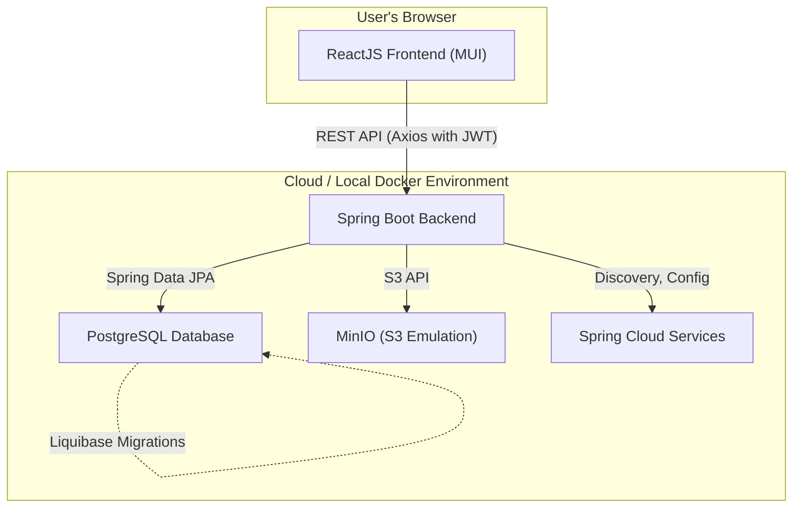

# Project Prompt Template

Use this template to kick off a ReactJS + Spring Boot cloud-native application. Fill in your project-specific details under **Your Requirements** and update as you progress.

---

## Project Overview

> Briefly describe what you’re building, who it’s for, and why.

**Your Requirements**  
> List high-level goals, non-functional requirements, or constraints.

---

## Why Spring Boot & ReactJS?

-   **Spring Boot (Backend):** A powerful, convention-over-configuration framework that accelerates Java application development.
    -   **Rapid Development:** Auto-configuration, embedded servers, and starter dependencies minimize boilerplate, allowing developers to focus on business logic.
    -   **Robust Ecosystem:** Seamlessly integrates with a vast ecosystem of tools for persistence (Spring Data), security (Spring Security), and more.
    -   **Path to Cloud-Native:** With **Spring Cloud**, you get a mature toolkit for building resilient, distributed systems. It provides patterns like service discovery, configuration management, and circuit breakers, offering a clear path to a cloud-native architecture.

-   **ReactJS (Frontend):** A declarative, component-based library for building interactive user interfaces.
    -   **Component Reusability:** Build encapsulated components that manage their own state, making UIs easier to build, test, and maintain.
    -   **Rich Ecosystem:** Access a vast library of tools and components, including Material UI for polished design systems and state management solutions.
    -   **Performance Optimization & Native Compilation:** For performance-critical sections of your application, **React Native** allows you to compile parts of your web-based code into native code for iOS and Android, offering a path to high-performance mobile experiences without leaving the React ecosystem.

---

## Why PostgreSQL, Liquibase, & MinIO?

-   **PostgreSQL:** A powerful, open-source relational database with enterprise-grade features.
    -   **Reliability & Data Integrity:** ACID compliance, robust transaction support, and advanced data types ensure your data remains consistent and reliable.
    -   **Scalability:** Supports both vertical scaling for larger machines and horizontal scaling through read replicas and partitioning.
    -   **Advanced Features:** JSON/JSONB support, full-text search, geospatial capabilities, and extensibility through custom functions and types.
    -   **Cloud Readiness:** All major cloud providers offer managed PostgreSQL services (AWS RDS, Azure Database for PostgreSQL, Google Cloud SQL).

-   **Liquibase:** Database schema evolution and version control.
    -   **Database-Agnostic:** While we use PostgreSQL in development and production, Liquibase's database-agnostic approach gives flexibility if database requirements change.
    -   **Declarative Changes:** XML, YAML, JSON, or SQL formats to define changes, making them readable and trackable.
    -   **Rollback Support:** Automated rollbacks if migrations fail, maintaining database integrity.
    -   **CI/CD Integration:** Seamlessly integrates with CI/CD pipelines for automated database updates during deployment.

-   **MinIO:** S3-compatible object storage for local development and beyond.
    -   **API Consistency:** Develop locally against the same S3 API you'll use in production, eliminating environment-specific code.
    -   **Performance:** High-performance object storage, even in containerized environments.
    -   **Scalability Path:** Start with MinIO locally, then seamlessly transition to any S3-compatible cloud storage (AWS S3, Google Cloud Storage, etc.) in production.
    -   **Kubernetes Native:** If your deployment evolves to Kubernetes, MinIO offers native integration.

---

## 1. Tech Stack



- **Frontend**  
  - React (initialized with `npx create-react-app`)  
  - Material UI for UI components
  - Axios for HTTP calls
  - **State Management**: use Redux Toolkit for predictable global state or consider more modern libs like Zustand for lightweight state and React Query (TanStack Query) for server state/data fetching
  - **Local Proxy Setup**: configure `proxy` in `package.json` to forward API requests to Spring Boot during local development.**: configure `proxy` in `package.json` to forward API requests to Spring Boot during local development.
- **Backend**  
  - Spring Boot (latest stable version)  
  - Spring Data JPA for persistence  
  - OpenFeign (modern version) for REST clients
  - Spring Security for authentication & authorization
  - **Server Port**: externalize `server.port` in **`application.yml`** or via environment variable `SERVER_PORT` (default `8080`).
- **Database**  
  - PostgreSQL (dockerized, dev port 5635)  
  - Liquibase for schema management

---

## 2. Local Development Proxy Setup

To streamline front-end/back-end integration locally:
1. **React Proxy**  
   - In `package.json`:
     ```json
     {
       "proxy": "http://localhost:${SERVER_PORT:-8080}"
     }
     ```
   - Run back end on your configured port (default `8080` or as set).
   - `npm start` will forward API calls (`/api/**`) automatically to Spring Boot.
2. **CORS Support**  
   - Ensure Spring Boot CORS config allows `http://localhost:3000` (CRA default).

---

## 3. Security Best Practices

### Frontend (React + Axios + JWT)
- **Authentication Flow**:  
  - On login, obtain a JWT access token and a long-lived refresh token.  
  - Store the **access token** in memory (e.g. React context or Redux) to reduce XSS risk.  
  - Store the **refresh token** in an HTTP-only, Secure cookie with `SameSite=Strict` for safe token rotation.
- **Token Rotation & Refresh**:  
  - Implement an Axios response interceptor to catch 401 errors and trigger a refresh using the refresh token cookie.  
  - On successful refresh, update in-memory access token and retry the failed request.
- **Axios Configuration**:
  ```js
  import axios from 'axios';
  import { getAccessToken, setAccessToken } from './authService';

  const api = axios.create({
    baseURL: process.env.REACT_APP_API_URL,
    withCredentials: true, // allow refresh cookie
    headers: { 'Content-Type': 'application/json' }
  });

  // Attach access token
  api.interceptors.request.use(config => {
    const token = getAccessToken();
    if (token) config.headers.Authorization = `Bearer ${token}`;
    return config;
  });

  // Handle token expiry
  api.interceptors.response.use(
    response => response,
    async error => {
      const originalRequest = error.config;
      if (error.response?.status === 401 && !originalRequest._retry) {
        originalRequest._retry = true;
        const newToken = await api.post('/auth/refresh').then(res => res.data.accessToken);
        setAccessToken(newToken);
        originalRequest.headers.Authorization = `Bearer ${newToken}`;
        return api(originalRequest);
      }
      return Promise.reject(error);
    }
  );

  export default api;
  ```
- **XSS & CSRF Protection**:  
  - Use React’s escaping and sanitize any HTML (e.g. DOMPurify).  
  - Rely on same-site cookies for CSRF mitigation when refreshing tokens.
- **Error Handling**:  
  - Centralize error handling to log out users on unrecoverable authorization failures.
- **Secure Headers**:  
  - Use a strict Content Security Policy via meta tags or server headers.

### Backend (Spring Boot + Spring Security + JWT)
- **Stateless Sessions**:  
  - Disable HTTP sessions and use JWTs exclusively:  
  ```java
  http
    .sessionManagement()
      .sessionCreationPolicy(SessionCreationPolicy.STATELESS)
    .and()...
  ```
- **JWT Provider & Filters**:
  - Implement a `JwtTokenProvider` to generate and validate tokens (with asymmetric or strong symmetric keys).  
  - Add a `JwtAuthenticationFilter` before the `UsernamePasswordAuthenticationFilter` in your security chain:
  ```java
  http
    .addFilterBefore(new JwtAuthenticationFilter(jwtTokenProvider), UsernamePasswordAuthenticationFilter.class)
  ```
- **Security Configuration**:
  ```java
  @Configuration
  public class SecurityConfig extends WebSecurityConfigurerAdapter {

    @Autowired private JwtTokenProvider jwtTokenProvider;

    @Override
    protected void configure(HttpSecurity http) throws Exception {
      http
        .cors().and()
        .csrf().disable()
        .sessionManagement()
          .sessionCreationPolicy(SessionCreationPolicy.STATELESS)
        .and()
        .authorizeRequests()
          .antMatchers("/auth/**", "/api/public/**").permitAll()
          .anyRequest().authenticated()
        .and()
        .exceptionHandling()
          .authenticationEntryPoint(new JwtAuthenticationEntryPoint())
        .and()
        .addFilterBefore(new JwtAuthenticationFilter(jwtTokenProvider), UsernamePasswordAuthenticationFilter.class);
    }

    // CORS bean as before
  }
  ```
- **Token Expiry & Refresh Endpoints**:  
  - Expose `/auth/login`, `/auth/refresh`, and `/auth/logout` endpoints.  
  - On refresh, issue a new access token and (optionally) rotate refresh token.
- **Password Storage**:  
  - Continue using `BCryptPasswordEncoder` for user credentials.
- **HTTP Security Headers & Secrets**:  
  - Continue adding HSTS, CSP, X-Frame-Options, etc.  
  - Store JWT signing keys and other secrets in Vault or environment variables.
- **Auditing & Logging**:  
  - Log token issuance, refresh attempts, and authentication failures for audit trails.

---

## 4. Database & Migration

1. **Schema Design**  
   - Define entities and relationships.  
   - Support multi-tenancy if needed.
2. **Liquibase Configuration**  
   - Use a **privileged** Liquibase user for migrations.  
   - Application uses a **separate, lower-privileged** user.  
   - Store Liquibase changelog tables in your application schema.  
   - Name changesets sequentially:
   ```xml
   00001-create-users-table.xml
   00002-add-email-index.xml
   ```
3. **Local Dev Setup**  
   ```yaml
   # docker-compose.yml
   version: '3.8'
   services:
     db:
       image: postgres:latest
       ports:
         - "5635:5432"
       environment:
         POSTGRES_USER: liquibase_user
         POSTGRES_PASSWORD: <secure-pw>
         POSTGRES_DB: your_app_db
   ```

---

## 5. File Storage (S3 Emulation with MinIO)

For applications requiring file storage, use MinIO for local development. MinIO provides an S3-compatible object storage server, allowing you to develop against the S3 API locally and deploy to any S3-compatible cloud storage (like AWS S3) in production without code changes.

1.  **Local Dev Setup (Docker Compose)**
    - Add MinIO to your `docker-compose.yml`:
    ```yaml
    # docker-compose.yml
    services:
      # ... your existing db service
      minio:
        image: minio/minio:latest
        ports:
          - "9000:9000"  # API port
          - "9001:9001"  # Console port
        environment:
          MINIO_ROOT_USER: minioadmin
          MINIO_ROOT_PASSWORD: minioadmin
        command: server /data --console-address ":9001"
    ```
    - Access the MinIO console at `http://localhost:9001` to create buckets (e.g., `your-app-bucket`).

2.  **Spring Boot Configuration**
    - Add the AWS S3 SDK dependency to your `pom.xml`:
    ```xml
    <dependency>
        <groupId>software.amazon.awssdk</groupId>
        <artifactId>s3</artifactId>
    </dependency>
    ```
    - Configure your `application.yml` to connect to the local MinIO instance:
    ```yaml
    aws:
      s3:
        endpoint: http://localhost:9000
        access-key-id: minioadmin
        secret-access-key: minioadmin
        region: us-east-1 # S3 client requires a region
        bucket-name: your-app-bucket
    ```
    - In your Spring service, you can now inject the `S3Client` and use it to upload/download files. For production, you would override these properties to point to your cloud S3 provider.

---

## 6. Code Conventions

- Use Lombok for JPA entities (`@Getter`, `@Setter`, `@Builder`, etc.) and entity mapping.
- **Avoid DTO Classes**: Prefer Spring Data Projections (interface-based or class-based) for query results instead of custom DTOs to reduce boilerplate and leverage repository optimizations.
- Always depend on the most recent stable versions of Spring Boot, Spring Data, OpenFeign, etc.  
- Organize packages clearly: `com.yourcompany.app.domain`, `.service`, `.web`, etc.

---

## 7. README & Project Plan

1. **Initial Sections**  
   - Project overview & goals  
   - Tech stack & architecture diagram  
2. **Implementation Details**  
   - DB user roles & Liquibase setup  
   - Docker Compose instructions  
   - React frontend scaffold instructions  
   - How to run & test the Spring Boot app  
   - **Configuration Files**: document settings in `application.yml` (including server.port, datasource, security).  
   - Security configuration summary
3. **README File Generation**  
   - Auto-generate a `README.md` with:
     ```markdown
     # Project Name
     
     ## Prerequisites
     - Docker & Docker Compose
     - Node.js & npm
     - Java 11+
     
     ## Setup & Run
     ```bash
     # Start PostgreSQL via Docker Compose
     docker-compose up -d

     # Start Spring Boot (default port from application.yml)
     ./mvnw spring-boot:run

     # Start React frontend (port 3000, proxy to backend)
     npm start
     ```
     
     ## Configuration
     - Edit `application.yml` for server.port, datasource credentials, and JWT settings.
     - Environment variables: `SERVER_PORT`, `JWT_SECRET`, etc.
     ```
4. **Project Plan**  
   - Track tasks in a “To Do / In Progress / Done” list  
   - Link to issue tracker or Kanban board

---

**Usage:** Copy this file into your repo, fill in each section, and share with your team or AI assistant to generate boilerplate code. Copy this file into your repo, fill in each section, and share with your team or AI assistant to generate boilerplate code. Copy this file into your repo, fill in each section, and share with your team or AI assistant to generate boilerplate code.
